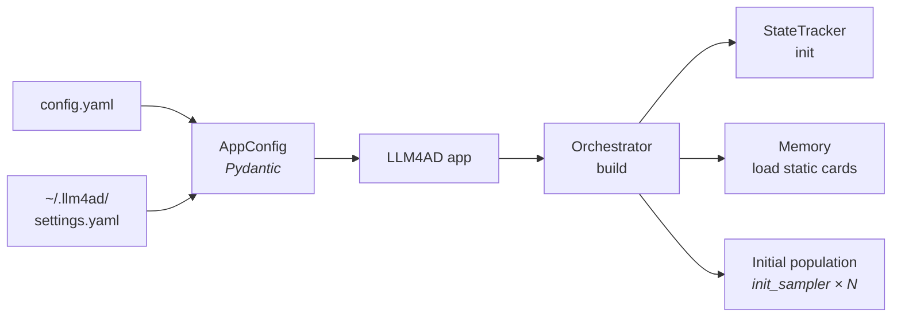
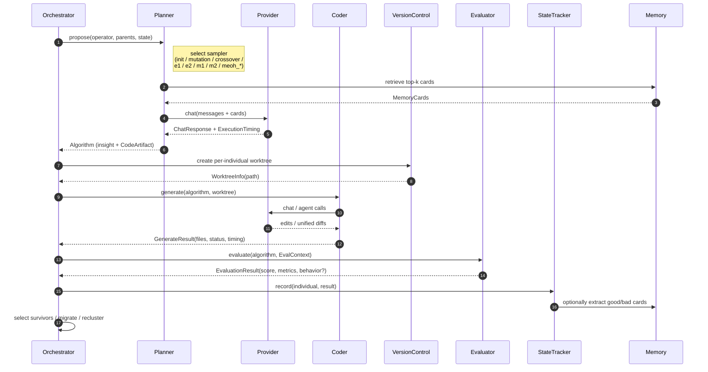

# Data Flow

The [Architecture Overview](overview.md) defines *what* the five components are. This page describes *what they do during a run* — the data they produce, the destinations of that data, and how knowledge accumulates across generations.

A LLM4AD run consists of four phases:

1. **Initialization** — load configuration, prepare the workspace, seed the population.
2. **Evolution loop** — for each generation: propose ideas, materialize them as code, evaluate, select survivors, persist results.
3. **State and knowledge management** — runs in parallel with the loop: state snapshots, trajectory, memory cards, checkpoints.
4. **Final output** — at run end, the `best/` snapshot and, for MEoH, the Pareto archive.

The same flow applies to all three orchestrators (`island_ga`, `dyca`, `meoh`); they differ only in which sampler is dispatched within the loop and how survivors are selected.

## Phase 1 — Initialization



The sequence is as follows:

1. The CLI invokes `llm4ad run config.yaml`. `AppConfig` is constructed by merging the per-task YAML on top of `~/.llm4ad/settings.yaml` (provider definitions). All `${VAR}` placeholders are expanded at this stage.
2. The workspace is created at `{base_dir}/{project_name}/{run_id}/` with the standard subdirectories (`state/`, `logs/`, `checkpoints/`, `generated/`, `best/`).
3. The orchestrator instantiates one Planner, one Coder, and one Evaluator from the validated configuration. Provider clients are initialized with retry, rate-limit, and multimodal handling.
4. `StateTracker` is initialized; static `MemoryCard` definitions declared in YAML are loaded.
5. The orchestrator invokes `init_sampler` `population_size` times to seed Generation 0. Each seeded individual traverses the full Coder and Evaluator path (see Phase 2, hops 2–4).

The flag `--resume <checkpoint.json>` skips step 5 and restores the population, history, and generation index from the specified checkpoint.

## Phase 2 — Evolution loop

This phase constitutes the core of a run. Each iteration produces one batch of children and writes one row of state. The numbered hops below correspond to the five-component diagram in the overview, expanded in detail.



The three sub-stages of the loop correspond to the three roles available for customization:

### 2a. Idea generation (Planner)

The orchestrator passes the planner an *operator* (`init`, `mutation`, `crossover`, one of the DyCA operators `e1` / `e2` / `m1` / `m2` / `summary`, or one of `meoh_*`), a list of parent algorithms, and the current `StateTracker`. The planner selects the corresponding sampler.

Each sampler comprises one prompt template and one Provider call. Prior to dispatching the request, the planner:

- retrieves the top-*k* relevant `MemoryCard`s ranked by similarity, bounded by `memory.max_prompt_cards`;
- splices parent code from the `EVOLVE_START` / `EVOLVE_END` blocks into the prompt;
- attaches multimodal `ContentPart` payloads (rendered behavior images) when applicable.

The provider returns a `ChatResponse` together with an `ExecutionTiming` envelope (network, streaming, parsing breakdowns). The planner then parses an `Algorithm` containing one or more `CodeArtifact` instances — either a `full` file body or a unified `diff`.

### 2b. Code generation (Coder)

The orchestrator requests a fresh git worktree from `VersionControl`, branched from the base commit. Coders never modify each other's files; concurrent candidates are isolated by construction.

The coder applies the planner's `CodeArtifact` within the worktree, restricted to `EVOLVE_START` / `EVOLVE_END` blocks identified by `repo_analyzer`. Three coding strategies are provided:

- `custom` — a single LLM call with diff hints; lowest latency and resource cost.
- `claude_code` and `opencode` — agent CLIs capable of iterating on errors before yielding control.

The output is a `GenerateResult` with `status ∈ {SUCCESS, PARTIAL, FAILED, TIMEOUT}` and per-phase timing.

### 2c. Evaluation (Evaluator)

The orchestrator constructs an `EvalContext` — `project_root`, `data_path`, per-instance `timeout`, and `behavior_storage` mode — and invokes `evaluate()`. The evaluator returns an `EvaluationResult`:

```python
EvaluationResult(
    score=...,                 # scalar fitness for single-objective runs
    metrics={...},             # named metrics; MEoH reads objective_metrics from this map
    metadata={...},            # arbitrary task-specific data
    success=True,
    duration_ms=...,
    behavior=BehaviorData(...) # optional; populated when multimodal is enabled
)
```

The built-in evaluator base classes (`PythonEvaluator`, `ExecutableEvaluator`, `BenchmarkEvaluator`, `LLMJudgeEvaluator`) cover the majority of use cases; custom evaluators are loaded via `module: pkg.module:ClassName`.

After evaluation, the orchestrator executes its survivor, migration, and reclustering logic — the *only* point at which the three orchestrators diverge.

## Phase 3 — State, knowledge, and timing

Phase 3 runs concurrently with Phase 2 rather than sequentially. It is the basis on which long-running experiments remain recoverable, debuggable, and self-improving.

| Artifact | Location | Write trigger |
|---|---|---|
| **Per-individual state** — every algorithm, prompt, code artifact, score, and lineage record | `state/evolution_state.json` | After each evaluation (powers Web UI and resume) |
| **Trajectory** — score over time and per-component embeddings used for diversity | within `state/evolution_state.json` | Continuously |
| **Memory cards** — automatically extracted insights (`good_algorithm`, `error_reflection`, `domain_knowledge`, `general_insight`) | `memory/` subdirectory (YAML) | When `memory.auto_extraction.enabled: true`, after each generation |
| **Checkpoints** — full snapshot for resume | `checkpoints/genN.json`, `checkpoints/last.json` | Every `evolution.checkpoint_interval` generations |
| **Per-call timing** — Provider, Coder, and Evaluator wall-clock breakdown | `state/evolution_state.json` (per individual) | Every component invocation |
| **Logs** — Loguru output | `logs/run.log` | Continuously |

Memory cards close the feedback loop: high-scoring algorithms are summarized into `good_algorithm` cards, failure traces into `error_reflection` cards, and both are reinjected into the prompts of subsequent sampler invocations. Static cards (domain knowledge, platform constraints) coexist with automatically extracted cards in the same store. Refer to [Configuration § Memory](../guides/configuration.md) for the relevant configuration keys.

## Phase 4 — Final output

When the loop terminates — by reaching the maximum generation count, triggering early stopping, or receiving a keyboard interrupt — the orchestrator returns control to the application, which then:

1. Saves a final `checkpoints/last.json`.
2. Invokes `BestExporter` to copy the winning worktree into `best/`. For MEoH runs, every member of the Pareto archive is exported under `best/pareto/<idx>/`.
3. Prints the `Best snapshot:` path so that downstream tools and the Web UI need not traverse worktree paths.

## Run directory layout

Phases 1 through 4 collectively produce the following on-disk structure:

```
{base_dir}/{project_name}/{run_id}/
├── best/                      # ← Phase 4: stable end-of-run snapshot
│   ├── code/                  #   plain copy of the winning worktree
│   ├── metadata.json
│   ├── summary.txt
│   └── pareto/<idx>/          #   only for multi-objective (MEoH) runs
├── state/
│   └── evolution_state.json   # ← Phase 3: every individual + trajectory
├── memory/                    # ← Phase 3: automatically extracted memory cards (YAML)
├── checkpoints/
│   ├── gen10.json
│   └── last.json -> gen10.json
├── logs/
│   └── run.log
├── generated/                 # per-individual generated code (worktree handoffs)
├── worktrees/                 # live git worktrees during evolution
└── temp/
```

## Resume

`llm4ad run config.yaml -r ./runs/.../checkpoints/last.json` reloads the `EvolutionCheckpoint` (population, history, generation index, metadata), rehydrates the `StateTracker`, and re-enters Phase 2 at the next generation. Provider, Coder, and Evaluator are reconstructed from the current configuration so that credentials and endpoints remain current. Memory cards previously persisted under `memory/` are reloaded at startup.

## See also

- [Architecture Overview](overview.md) — the five components themselves.
- [Orchestration Methods](../guides/orchestration.md) — the variations introduced at the survivor-selection step.
- [Timing & Metrics](../guides/timing-metrics.md) — the semantics of each `ExecutionTiming` field.
- [Configuration § Memory](../guides/configuration.md) — enabling automatic extraction.
