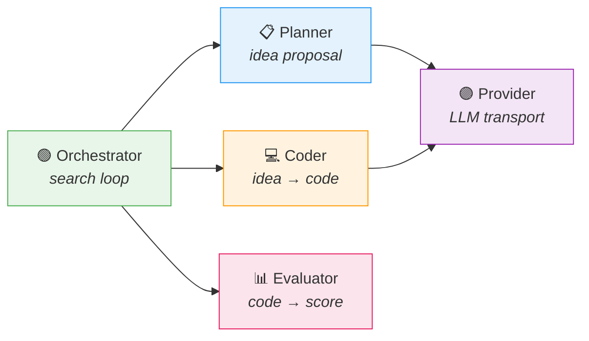

# Architecture Overview

LLM4AD is built on a single observation: every "iteration + LLM" algorithm-design method, regardless of how it is presented in the literature, ultimately performs four operations — *propose an idea*, *materialize the idea as code*, *evaluate the code*, *select which ideas advance to the next iteration*. LLM4AD assigns each operation to one cohesive, replaceable component, and stops there.

This page describes the design philosophy behind that decomposition. The next page, [Data Flow](data-flow.md), traces how data moves through the system during a run; [Orchestration Methods](../guides/orchestration.md) demonstrates how the same components compose into FunSearch, EoH, MEoH, multimodal variants, and other published methods.

## Design philosophy

**One responsibility per component, one component per responsibility.** The platform exposes exactly five extension roles. Each role has a base class, a registry, and a documented interface. Concerns below the public surface — HTTP retries, git worktree management, file IO, asynchronous batching — are infrastructure rather than extension points.

The diagram is the entire system. There is no hidden middleware, no implicit global state, and no out-of-band data flow. Each edge corresponds to a typed Python call whose definition resides in [`src/llm4ad/`](https://github.com/Optima-CityU/LLM4AD_Next/tree/main/src/llm4ad).

## The five components

| Role | Responsibility | Built-in implementations | Source |
|---|---|---|---|
| **Provider** | Presents a single `chat()` interface over OpenAI, Anthropic, and OpenAI-compatible endpoints. Encapsulates retries, rate limiting, multimodal `ContentPart` payloads, and DeepSeek `reasoning_content` propagation. | `openai_compatible`, `anthropic`, `mock` | [`provider/`](https://github.com/Optima-CityU/LLM4AD_Next/tree/main/src/llm4ad/infra/provider) |
| **Planner** | Drives a configurable chain of *samplers* (init, mutation, crossover, multimodal variants, DyCA `e1`/`e2`/`m1`/`m2`/`summary`, and `meoh_*`). Each sampler combines one prompt template with one Provider call. | `llm_evolution`, `meoh_evolution` | [`planner/`](https://github.com/Optima-CityU/LLM4AD_Next/tree/main/src/llm4ad/planner) |
| **Coder** | Materializes a proposed idea as source code. Edits are confined to `EVOLVE_START` / `EVOLVE_END` blocks within a per-individual git worktree. | `custom` (diff-based), `claude_code`, `opencode` | [`coder/`](https://github.com/Optima-CityU/LLM4AD_Next/tree/main/src/llm4ad/coder) |
| **Evaluator** | Executes the generated code and returns a scalar `score`, named metrics, and optional behavior data such as rendered images or trajectories. | `PythonEvaluator`, `ExecutableEvaluator`, `BenchmarkEvaluator`, `LLMJudgeEvaluator` | [`evaluator/`](https://github.com/Optima-CityU/LLM4AD_Next/tree/main/src/llm4ad/evaluator) |
| **Orchestrator** | Implements the search loop: sampler dispatch, parent selection, survivor selection, checkpoint cadence. | `island_ga`, `dyca`, `meoh` | [`orchestrator/`](https://github.com/Optima-CityU/LLM4AD_Next/tree/main/src/llm4ad/orchestrator) |

Each built-in implementation represents one valid realization of its role. New implementations are introduced via `@register_*` decorators and selected by name in YAML; no fork or core modification is required.

## Implications of atomicity

The atomic decomposition yields three concrete benefits:

**1. Composition without intrusion.** Switching from FunSearch-style island evolution to MEoH-style multi-objective search requires only a change to `evolution.type`. Provider, Coder, and Evaluator remain unchanged. Symmetrically, replacing `claude_code` with `opencode` does not require any modification to the orchestrator.

**2. Coverage of published methods through the same components.** Most published "LLM-driven evolutionary algorithm design" methods reduce to a particular choice of *which samplers fire* and *how survivors are selected*. Both decisions are exposed at the component level:

| Published method | Realization in LLM4AD |
|---|---|
| FunSearch (Romera-Paredes et al., 2024) | `island_ga` orchestrator with `init_sampler` and `mutation_sampler` |
| EoH (Liu et al., 2024) | DyCA samplers `e1` / `e2` / `m1` / `m2` (the operator names in DyCA originate from EoH) |
| Multimodal EoH | DyCA samplers extended with `multimodal_*` variants and `behavior_storage: "rendered"` |
| MEoH (multi-objective EoH) | `meoh` orchestrator with `objective_metrics: [...]` |
| ReEvo / self-reflection | A custom mutation sampler that injects reflection prompts |
| LLM-as-judge benchmarks | `LLMJudgeEvaluator` paired with any orchestrator |

The complete mapping is provided in [Orchestration Methods](../guides/orchestration.md).

**3. Small unit of extension.** A new sampler is one Python class with a `sample()` method and an associated prompt template. A new evaluator is `evaluate(ctx) -> EvaluationResult`. A new orchestrator is the dispatch and survival loop. Modifying one behavior never requires changes to unrelated components.

## What is *not* a role

The following modules are part of the codebase but constitute infrastructure rather than extension points:

- **`infra/version_control/`** — Per-individual git worktrees that isolate concurrent candidates.
- **`infra/repo_analyzer/`** — Discovers and validates `EVOLVE_START` / `EVOLVE_END` blocks; backs the `llm4ad evolve check` command.
- **`infra/state.py`** — `StateTracker` persists every individual to `state/evolution_state.json`, supporting resume and the Web UI.
- **`infra/best_exporter.py`** — At run end, snapshots the best worktree (and, for MEoH, every Pareto-archive member) into `best/`.
- **`infra/timing.py`** — `ExecutionTiming` records per-phase wall-clock measurements at every Provider, Coder, and Evaluator invocation.
- **`config/`** — Pydantic schemas using discriminated unions on `evolution.type`, `evaluator.type`, and `coder.type`. YAML input is validated into typed Python objects.

These modules are documented for diagnostic reading rather than subclassing.

## Outcomes

- **No vendor lock-in at the LLM layer.** Providers can be selected per role — for example, an inexpensive planner paired with a more capable coder.
- **Reproducibility by construction.** A configuration, run identifier, and checkpoint together produce an exact replay of the run.
- **Low-cost method comparison.** Running FunSearch and MEoH against the same evaluator requires only two configuration files.
- **First-class multi-objective and multimodal support.** Both are expressed through samplers and archive types, not as bolt-on extensions.

## Next steps

- [Data Flow](data-flow.md) — How data moves between the components during a single evolution run.
- [Orchestration Methods](../guides/orchestration.md) — Selecting and composing search strategies.
- [Configuration Guide](../guides/configuration.md) — The YAML schema that wires the components together.
