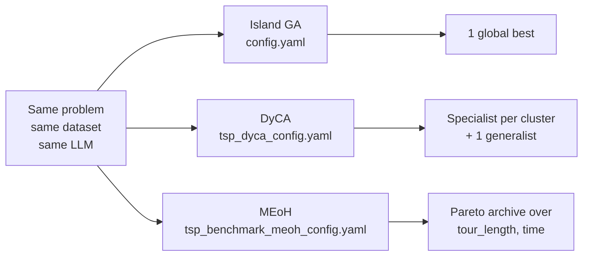

# TSP Benchmark

End-to-end walkthrough of [`examples/applications/tsp_benchmark_python/`](https://github.com/Optima-CityU/LLM4AD_Next/tree/main/examples/applications/tsp_benchmark_python). The task is to evolve a Traveling Salesman Problem solver (a nearest-neighbor / local-search style routine) that minimizes tour length on a diverse dataset covering small random, clustered, and large random instances.

This is the only shipped example that ships **three orchestrator configurations** for the same task. It's the easiest way to see Island GA, DyCA, and MEoH side-by-side.

## What evolves

The EVOLVE block is in `tsp_algorithm/`:

```python
# EVOLVE_START
def nearest_neighbor_tsp(nodes):
    """Solve TSP and return tour as list of node indices."""
    pass
# EVOLVE_END
```

The evaluator hands each dataset instance (a list of (x,y) coordinates) to this function, validates the tour, and measures total Euclidean distance.

## The three configs

```text
examples/applications/tsp_benchmark_python/
├── config.yaml                          # Default: Island GA
├── tsp_dyca_config.yaml                 # DyCA: cluster instances, specialist pools
├── tsp_benchmark_meoh_config.yaml       # MEoH: multi-objective tour_length + execution_time_ms
└── tsp_benchmark_meoh_debug_config.yaml # MEoH with tight budgets for debugging
```

| Config | type | Strength | Use when |
|---|---|---|---|
| `config.yaml` | island_ga | Simple, parallel, explainable | You want one winner |
| `tsp_dyca_config.yaml` | dyca | Specialist algorithms per instance cluster | Dataset has natural heterogeneity (small / clustered / large) |
| `tsp_benchmark_meoh_config.yaml` | meoh | Pareto front of speed vs. quality | You want multiple trade-off algorithms |

## How to run

```bash
cd LLM4AD
export LLM_BASE_URL="https://api.openai.com/v1"
export LLM_API_KEY="sk-..."
export LLM_MODEL="gpt-4o-mini"

# 1) Island GA (default, fastest)
llm4ad run examples/applications/tsp_benchmark_python/config.yaml

# 2) DyCA — instance clustering
llm4ad run examples/applications/tsp_benchmark_python/tsp_dyca_config.yaml

# 3) MEoH — multi-objective Pareto front
llm4ad run examples/applications/tsp_benchmark_python/tsp_benchmark_meoh_config.yaml
```

The MEoH config is multi-objective, so the CLI output changes shape:

```text
[bold green]Pipeline completed successfully![/bold green] Best objectives: [tour_length=482.15, execution_time_ms=12.30]
Elitist archive: 6 non-dominated solutions
  - meoh_e2_op_3: [tour_length=482.15, execution_time_ms=12.30]
  - meoh_m1_op_7: [tour_length=494.87, execution_time_ms=4.10]
  ...
Best snapshot: runs/tsp_benchmark_python/<run_id>/best
```

Each non-dominated solution is exported under `best/pareto/<idx>/`.

## Dataset shape

`data/diverse/` is generated by `generate_diverse_data.py`. Each file is a list of nodes:

```json
{"nodes": [[0.12, 0.84], [0.31, 0.55], [0.91, 0.07], ...]}
```

The evaluator (`tsp_evaluator.py:PythonTSPEvaluator`) walks the directory in parallel via `dataset.mode: directory`, scoring every instance, and the `aggregate(...)` method averages `tour_length` across them.

## Comparing the orchestrators



After running all three, compare the trends in `runs/tsp_benchmark_python/<run_id>/best/summary.txt`. This is the fastest way to develop intuition for which orchestrator suits a problem.

## Reading the results

```bash
# Per non-dominated solution (MEoH only):
ls runs/tsp_benchmark_python/<run_id>/best/pareto/
# Each has a complete worktree you can run

# Smoke-run the winning nearest_neighbor replacement on a fresh instance:
cd runs/tsp_benchmark_python/<run_id>/best/code
python tsp_solver.py "$(cat new_instance.json)"
```

## Variations to try

- **Mix coders**: in the same config, set `coder.type: claude_code` and use `planner.provider: default` + `coder.provider: stronger_model` so planning runs on a cheaper model and coding on a stronger one.
- **Larger instances**: generate 100-city instances with `generate_tsp100_data.py` and bump `evaluator.timeout` to 300.
- **Multimodal variant**: `tsp_benchmark_python_multimodal/config.yaml` is a drop-in template that renders tours as images and feeds them into prompts.

## See also

- [DyCA](../guides/dyca.md) · [MEoH](../guides/meoh.md) · [Island GA](../guides/island-ga.md)
- [Orchestration Methods Overview](../guides/orchestration.md) — choosing an orchestrator
- [Configuration Guide](../guides/configuration.md) — every YAML key
