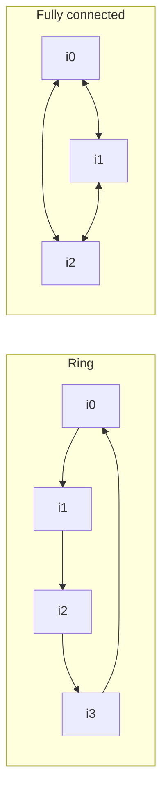

# Island GA Orchestrator

Island GA is the default, simplest orchestrator. Multiple independent populations ("islands") evolve in parallel, with periodic migration of individuals between them. It's the right starting point when you want one best algorithm and your dataset is roughly homogeneous.

## When to use it

- You want a quick, predictable single-objective run.
- The dataset doesn't have a clear cluster structure.
- You can spread islands across cores for parallel exploration.

For multi-objective tasks, use [MEoH](meoh.md). For heterogeneous datasets that benefit from specialists, use [DyCA](dyca.md). Comparison: [Orchestration Methods Overview](orchestration.md).

## Configuration

```yaml
evolution:
  type: "island_ga"
  max_generations: 30

  # Per-island
  num_islands: 5
  island_population_size: 6
  parallel_islands: true

  # Operators (inherited from EvolutionConfig)
  elite_ratio: 0.1
  mutation_rate: 0.3
  crossover_rate: 0.5
  parent_selection_strategy: "tournament"
  survival_selection_strategy: "truncation"
  tournament_size: 3

  # Migration
  migration_interval: 5                # every N generations
  migration_rate: 0.1                  # fraction of each island
  migration_strategy: "best"           # or "random" / "elite" / "worst"
  migration_topology: "ring"           # or "full" / "hierarchy" / "mesh"

  # Optional: per-island overrides
  per_island_config:
    0: { mutation_rate: 0.5 }          # island 0 explores harder
```

`IslandGAConfig` (`src/llm4ad/config/evolution.py`) validates these fields.

## How it works

1. **Init** — create `num_islands` populations, each with `island_population_size` individuals using `init_sampler`.
2. **Per generation, on each island in parallel** (`parallel_islands: true`):
   - Select parents (tournament / roulette / rank).
   - Apply `mutation_sampler` and `crossover_sampler` to produce offspring.
   - Survive top individuals using `survival_selection_strategy`.
3. **Every `migration_interval` generations**: migrate `migration_rate × island_size` individuals between islands per `migration_topology` and `migration_strategy`.
4. **Stop** when `max_generations` is reached or `early_stop_patience` triggers.

The orchestrator lives at `src/llm4ad/orchestrator/island_ga.py`. It uses the standard samplers (`init_sampler`, `mutation_sampler`, `crossover_sampler`); for multimodal tasks swap them for `multimodal_*` variants and set `multimodal.enabled: true`.

## Migration topologies



- `ring` — each island sends to the next; cheap, slow information spread.
- `full` — every island sees every other; fast information spread, more diversity loss.
- `hierarchy` — tree structure; useful with many islands.
- `mesh` — custom neighbors via `per_island_config`.

## Worked example

The default sorting and TSP examples use Island GA out of the box:

```bash
llm4ad run examples/applications/sorting_benchmark_python/config.yaml
llm4ad run examples/applications/tsp_benchmark_python/config.yaml
```

Both walkthroughs ([Sorting](../examples/sorting.md), [TSP](../examples/tsp.md)) ship with `num_islands: 2` and `island_population_size: 2-4` for fast smoke runs. For real experiments bump them to `num_islands: 4-8`, `island_population_size: 6-10`.

## Tuning

- **`num_islands × island_population_size`** is the total population. Aim for 20–60 individuals; more if the LLM is cheap, fewer if expensive.
- **`migration_interval`** ≈ `max_generations / 5` is a reasonable default. Too frequent and islands homogenize; too rare and they drift.
- **`elite_ratio: 0.1–0.2`** keeps the best individuals across generations to avoid losing them to bad luck.
- **`tournament_size`** controls selection pressure: 2 = soft, 5+ = harsh. Default 3 is a good middle.
- For very heterogeneous islands, set `per_island_config` so some islands explore harder (high `mutation_rate`) while others exploit (low `mutation_rate`, high `elite_ratio`).

## See also

- [Orchestration Methods Overview](orchestration.md) — Island GA vs DyCA vs MEoH
- [Configuration Guide](configuration.md) — full Island GA field reference
- Source of truth: `src/llm4ad/orchestrator/island_ga.py`
