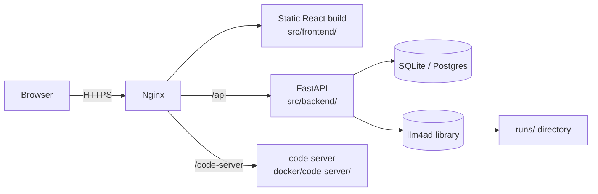

# Web UI Overview

LLM4AD ships an optional Web UI built on a FastAPI backend and a React + Vite frontend. It exposes the same pipeline as the CLI but adds project management, configuration forms, run monitoring, the "rapid analysis" trajectory viewer, and the in-app User Manual you're currently reading.

This page covers the architecture, deployment options, environment variables, and where to dig deeper.

## Architecture



The three containers can run on a single host or split across machines.

| Component | Path | Purpose |
|---|---|---|
| Frontend | `src/frontend/` | React + Vite + TypeScript; served as static assets via nginx in production |
| Backend | `src/backend/` | FastAPI service that exposes project / task / report / provider APIs |
| code-server | `docker/code-server/` | Optional in-browser VS Code for editing generated code |

## Run modes

### Development (no Docker)

```bash
# Backend
cd src/backend
uv sync
uv run fastapi dev app/main.py            # http://localhost:8000

# Frontend
cd src/frontend
bun install
bun run dev                               # http://localhost:5173
```

The frontend dev server proxies `/api/*` to the backend (see `src/frontend/vite.config.ts`). Hot reload works for both halves.

### Docker (production-like)

Each component has a Dockerfile:

- `src/backend/Dockerfile` — Python 3.12 + uv, runs `fastapi run --workers 4 app/main.py`.
- `src/frontend/Dockerfile` — multi-stage: bun build → nginx serve. Static assets are embedded at build time, including the `docs/` tree (line 11 of the Dockerfile).
- `docker/code-server/` — optional VS Code in browser.

Compose them with your own `docker-compose.yml` (an example sits in the repo root once you fill the env block); fundamentally:

```yaml
services:
  backend:
    build:
      context: .
      dockerfile: src/backend/Dockerfile
    environment:
      - LLM4AD_DATABASE_URL=sqlite:////data/llm4ad.db
      - LLM4AD_RUNS_DIR=/data/runs
    volumes:
      - llm4ad-data:/data

  frontend:
    build:
      context: .
      dockerfile: src/frontend/Dockerfile
      args:
        - VITE_API_URL=https://app.example.com/api
        - VITE_CODE_SERVER_URL=https://app.example.com/code-server
    ports:
      - "80:80"
    volumes:
      - ./src/frontend/extra-conf.d:/etc/nginx/extra-conf.d:ro
```

The frontend Docker image accepts two build args:

| Build arg | Purpose |
|---|---|
| `VITE_API_URL` | Where the backend lives, baked into the JS bundle |
| `VITE_CODE_SERVER_URL` | Where code-server lives (optional) |

Nginx config inside the image lives at `src/frontend/nginx.conf`; you can mount additional snippets into `/etc/nginx/extra-conf.d/` for SSL, auth, etc.

## Environment variables (backend)

Backend config goes through env vars (see `src/backend/app/config.py` for the source of truth). The most relevant ones:

| Var | Default | Purpose |
|---|---|---|
| `LLM4AD_DATABASE_URL` | `sqlite:///./llm4ad.db` | SQLAlchemy URL for project/task/report storage |
| `LLM4AD_RUNS_DIR` | `./runs` | Where pipeline runs land (`base_dir` for run subdirectories) |
| `LLM4AD_BUILDS_DIR` | `./builds` | Where `llm4ad chat` outputs land per user |
| `LLM4AD_CODE_SERVER_URL` | _(unset)_ | If set, the frontend exposes a "Open in IDE" link |
| `LLM4AD_DEFAULT_MODEL` | _(unset)_ | Used as the default LLM provider when the user hasn't picked one |

Per-user provider credentials are stored encrypted in the DB and managed via the Web UI's Settings page; they're never written to disk in clear text.

## In-app User Manual

The Web UI ships an in-app **User Manual** ("使用手册") that loads markdown directly from the `docs/` directory at build time:

```
src/frontend/Dockerfile  : COPY ./docs /docs
src/frontend/vite.config.ts : alias @docs → ../../docs
src/frontend/src/components/Guide/UserManualContent.tsx
                          : import.meta.glob("@docs/**/*.md") → /{lang}/{key}.md
src/frontend/src/components/Guide/guide.config.ts
                          : navigation hierarchy
```

That means edits to `docs/{en,zh}/...` ship to the Web UI on the next frontend build — nothing to upload, nothing to call. To add a page, drop a markdown file into `docs/{en,zh}/<key>.md` and add a matching `key:` entry to `guide.config.ts`. See [Frontend Integration](frontend-integration.md) for the deeper integration patterns.

## Where to learn more

- [Frontend Integration](frontend-integration.md) — embedding LLM4AD pipelines into multi-user web platforms
- [Auto Builder (chat)](../guides/auto-builder.md) — the workflow the Web UI uses to scaffold new projects
- `src/backend/app/api/llm4ad/` — REST endpoints exposed to the frontend
- `src/frontend/src/components/Guide/` — Web UI source for the User Manual
