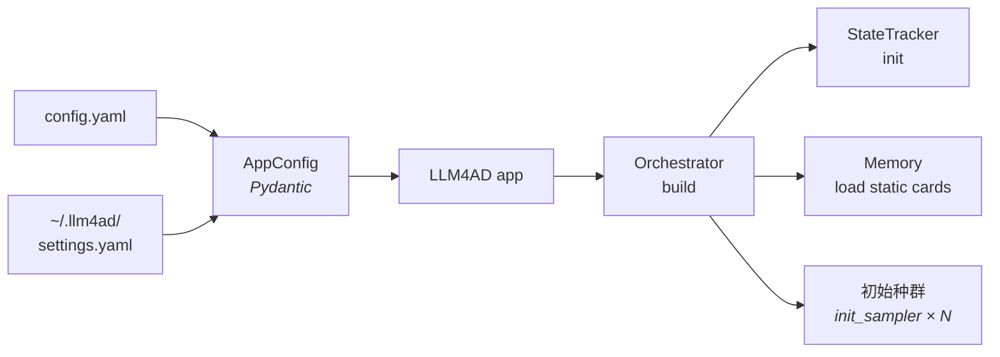
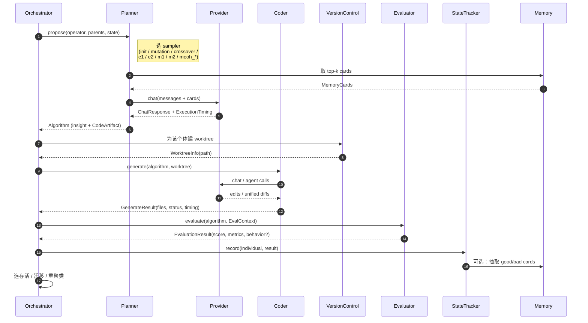

# 数据流

[架构概览](overview.md)定义了五个组件的*角色*。本页描述它们*在一次运行中如何协作*——所产生的数据、数据的去向，以及知识在代际之间的累积方式。

一次 LLM4AD 运行包含四个阶段：

1. **初始化** — 加载配置，准备工作区，播种初始种群。
2. **进化循环** — 每一代：提出想法，将其实现为代码，进行评估，选择存活者，持久化结果。
3. **状态与知识管理** — 与循环并行进行：状态快照、轨迹、memory card、checkpoint。
4. **最终产出** — 运行结束时的 `best/` 快照，以及 MEoH 场景下的 Pareto 存档。

同一套流程适用于全部三个编排器（`island_ga`、`dyca`、`meoh`），其差异仅体现在循环内分发哪个 sampler、以及如何选择存活者。

## 阶段 1 — 初始化



执行顺序如下：

1. CLI 调用 `llm4ad run config.yaml`。`AppConfig` 由当前任务 YAML 与 `~/.llm4ad/settings.yaml`（provider 定义）合并构建；所有 `${VAR}` 占位符在此阶段展开。
2. 工作区在 `{base_dir}/{project_name}/{run_id}/` 下创建，包含标准子目录（`state/`、`logs/`、`checkpoints/`、`generated/`、`best/`）。
3. 编排器从校验通过的配置实例化一个 Planner、一个 Coder 和一个 Evaluator。Provider 客户端启动时一并初始化重试、限流与多模态处理。
4. `StateTracker` 完成初始化；YAML 中声明的静态 `MemoryCard` 被加载。
5. 编排器调用 `init_sampler` `population_size` 次以播种第 0 代。每个种子个体均完整经历 Coder 与 Evaluator 路径（参见阶段 2 的 hop 2–4）。

`--resume <checkpoint.json>` 选项跳过第 5 步，转而从指定 checkpoint 恢复种群、历史记录与代数索引。

## 阶段 2 — 进化循环

本阶段构成运行的核心。每次迭代产生一批子代，写入一行状态。下文带编号的 hop 对应概览中的五组件示意图，并展开至更细粒度。



循环的三个子阶段对应三个可定制的角色：

### 2a. 想法生成（Planner）

编排器向 Planner 传入一个 *算子*（`init`、`mutation`、`crossover`、DyCA 算子 `e1` / `e2` / `m1` / `m2` / `summary` 之一，或 `meoh_*` 之一）、一组父代算法、当前 `StateTracker`。Planner 选定对应的 sampler。

每个 sampler 由一份 prompt 模板与一次 Provider 调用构成。在发出请求前，Planner 会：

- 按相似度排序检索前 *k* 条相关 `MemoryCard`，受 `memory.max_prompt_cards` 上限约束；
- 将父代代码从 `EVOLVE_START` / `EVOLVE_END` 块拼入 prompt；
- 在适用情形下附上多模态 `ContentPart` 载荷（渲染好的行为图像）。

Provider 返回 `ChatResponse` 以及 `ExecutionTiming`（网络、流式、解析的分阶段计时）。Planner 进而解析出 `Algorithm`，其中包含一个或多个 `CodeArtifact`——可为 `full` 完整文件，亦可为 `diff` 形式。

### 2b. 代码生成（Coder）

编排器向 `VersionControl` 申请一个从基线 commit 分叉的全新 git worktree。各 Coder 之间互不修改对方文件；并发候选在构造层面即被隔离。

Coder 在 worktree 内应用 Planner 的 `CodeArtifact`，编辑严格限定在 `repo_analyzer` 识别出的 `EVOLVE_START` / `EVOLVE_END` 块内。可用的三种编码策略：

- `custom` — 一次 LLM 调用 + diff 提示；时延与资源开销最低。
- `claude_code` 与 `opencode` — agent CLI，可在出错时迭代修正后再交付。

输出为 `GenerateResult`，`status ∈ {SUCCESS, PARTIAL, FAILED, TIMEOUT}`，并附分阶段计时。

### 2c. 评估（Evaluator）

编排器构造 `EvalContext`——`project_root`、`data_path`、单实例 `timeout`、`behavior_storage` 模式——并调用 `evaluate()`。Evaluator 返回 `EvaluationResult`：

```python
EvaluationResult(
    score=...,                 # 单目标运行下的标量适应度
    metrics={...},             # 命名指标；MEoH 从此映射读取 objective_metrics
    metadata={...},            # 任意任务相关数据
    success=True,
    duration_ms=...,
    behavior=BehaviorData(...) # 可选；多模态启用时填充
)
```

内置 evaluator 基类（`PythonEvaluator`、`ExecutableEvaluator`、`BenchmarkEvaluator`、`LLMJudgeEvaluator`）覆盖大多数场景；自定义 evaluator 通过 `module: pkg.module:ClassName` 加载。

评估完成后，编排器执行各自的存活、迁移与重聚类逻辑——这是三个编排器*唯一*出现分歧的环节。

## 阶段 3 — 状态、知识与计时

阶段 3 与阶段 2 并行进行，而非顺序衔接。它是长时间运行得以可恢复、可调试、能自我改进的基础。

| 产物 | 位置 | 写入时机 |
|---|---|---|
| **个体状态** — 每个算法、prompt、代码产物、分数与谱系 | `state/evolution_state.json` | 每次评估之后（驱动 Web UI 与 resume） |
| **轨迹** — 分数随时间变化、组件级 embedding（用于多样性） | 位于 `state/evolution_state.json` 内部 | 持续 |
| **Memory card** — 自动抽取的洞察（`good_algorithm`、`error_reflection`、`domain_knowledge`、`general_insight`） | `memory/` 子目录（YAML） | `memory.auto_extraction.enabled: true` 时，每代之后 |
| **Checkpoint** — 完整快照，用于 resume | `checkpoints/genN.json`、`checkpoints/last.json` | 每 `evolution.checkpoint_interval` 代 |
| **逐次调用计时** — Provider、Coder、Evaluator 的墙钟分解 | `state/evolution_state.json`（按个体） | 每次组件调用 |
| **日志** — Loguru 输出 | `logs/run.log` | 持续 |

Memory card 形成反馈闭环：高分算法被总结为 `good_algorithm` card，失败 trace 被总结为 `error_reflection` card，二者随后被注入后续 sampler 调用的 prompt。静态 card（领域知识、平台约束）与自动抽取的 card 共存于同一存储。相关配置项见[配置 § Memory](../guides/configuration.md)。

## 阶段 4 — 最终产出

循环终止——由达到最大代数、触发提前停止或收到键盘中断——之后，编排器将控制权交还给应用，应用随即：

1. 保存最终的 `checkpoints/last.json`。
2. 调用 `BestExporter` 将胜出的 worktree 拷贝至 `best/`。MEoH 运行下，Pareto 存档的每个成员均导出至 `best/pareto/<idx>/`。
3. 打印 `Best snapshot:` 路径，使下游工具与 Web UI 不必遍历 worktree 路径。

## 运行目录布局

四个阶段合计在磁盘上产生如下结构：

```
{base_dir}/{project_name}/{run_id}/
├── best/                      # ← 阶段 4：稳定的终态快照
│   ├── code/                  #   胜出 worktree 的纯目录拷贝
│   ├── metadata.json
│   ├── summary.txt
│   └── pareto/<idx>/          #   仅多目标（MEoH）运行
├── state/
│   └── evolution_state.json   # ← 阶段 3：每个个体 + 轨迹
├── memory/                    # ← 阶段 3：自动抽取的 memory card（YAML）
├── checkpoints/
│   ├── gen10.json
│   └── last.json -> gen10.json
├── logs/
│   └── run.log
├── generated/                 # 按个体生成的代码（worktree 交接产物）
├── worktrees/                 # 进化期间的实时 git worktree
└── temp/
```

## Resume

`llm4ad run config.yaml -r ./runs/.../checkpoints/last.json` 会重新加载 `EvolutionCheckpoint`（种群、历史、代数索引、元数据），重建 `StateTracker`，并从下一代重新进入阶段 2。Provider、Coder、Evaluator 均依据当前配置重新构建，凭据与端点保持最新。先前持久化于 `memory/` 下的 memory card 在启动时一并重新加载。

## 另见

- [架构概览](overview.md) — 五个组件本身。
- [编排方法](../guides/orchestration.md) — 存活选择步骤上引入的差异。
- [计时与指标](../guides/timing-metrics.md) — 各 `ExecutionTiming` 字段的语义。
- [配置 § Memory](../guides/configuration.md) — 启用自动抽取。
