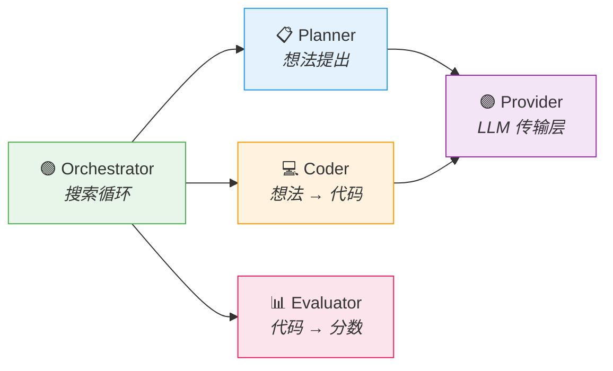

# 架构概览

LLM4AD 的设计基于一个核心观察：所有"迭代 + LLM"的算法设计方法，无论文献中如何呈现，最终都执行四类操作——*提出想法*、*将想法实现为代码*、*评估代码*、*选择进入下一轮迭代的想法*。LLM4AD 为每一类操作分配一个内聚、可替换的组件，仅此而已。

本页阐述这种分解背后的设计哲学。下一页[数据流](data-flow.md)描绘运行期间数据在系统中的流动；[编排方法](../guides/orchestration.md)演示同一组组件如何组合出 FunSearch、EoH、MEoH、多模态变种以及其他已发表方法。

## 设计哲学

**一个组件一项职责，一项职责一个组件。** 平台对外暴露五个扩展角色，每个角色配有基类、注册表和明确的接口约定。公共接口之下的关切——HTTP 重试、git worktree 管理、文件 IO、异步批处理——属于基础设施，而非扩展点。

该图即为系统的全部。不存在隐藏的中间件、隐式的全局状态，或带外的数据通路。每条边对应一次有类型签名的 Python 调用，其定义可在 [`src/llm4ad/`](https://github.com/llm4ad/llm4ad/tree/main/src/llm4ad) 中查阅。

## 五个组件

| 角色 | 职责 | 内置实现 | 源码 |
|---|---|---|---|
| **Provider** | 在 OpenAI、Anthropic、OpenAI 兼容端点之上提供统一的 `chat()` 接口；封装重试、限流、多模态 `ContentPart` 载荷以及 DeepSeek `reasoning_content` 透传。 | `openai_compatible`、`anthropic`、`mock` | [`provider/`](https://github.com/llm4ad/llm4ad/tree/main/src/llm4ad/infra/provider) |
| **Planner** | 驱动一条可配置的 *sampler 链*（init、mutation、crossover、多模态变种、DyCA 的 `e1`/`e2`/`m1`/`m2`/`summary`、以及 `meoh_*`）。每个 sampler 由一份 prompt 模板与一次 Provider 调用组成。 | `llm_evolution`、`meoh_evolution` | [`planner/`](https://github.com/llm4ad/llm4ad/tree/main/src/llm4ad/planner) |
| **Coder** | 将所提出的想法实现为源代码。编辑严格限定在 `EVOLVE_START` / `EVOLVE_END` 块内，并在每个个体专属的 git worktree 中进行。 | `custom`（基于 diff）、`claude_code`、`opencode` | [`coder/`](https://github.com/llm4ad/llm4ad/tree/main/src/llm4ad/coder) |
| **Evaluator** | 执行生成的代码，返回标量 `score`、命名指标，以及可选的行为数据（如渲染图像或轨迹）。 | `PythonEvaluator`、`ExecutableEvaluator`、`BenchmarkEvaluator`、`LLMJudgeEvaluator` | [`evaluator/`](https://github.com/llm4ad/llm4ad/tree/main/src/llm4ad/evaluator) |
| **Orchestrator** | 实现搜索循环：sampler 调度、父代选择、存活选择、checkpoint 节奏。 | `island_ga`、`dyca`、`meoh` | [`orchestrator/`](https://github.com/llm4ad/llm4ad/tree/main/src/llm4ad/orchestrator) |

每个内置实现仅是其对应角色的一种合法实现。新实现通过 `@register_*` 装饰器引入，由 YAML 中的名称选定，无需 fork 或修改核心代码。

## 原子性的意义

原子化分解带来三项具体收益：

**1. 无侵入式组合。** 从 FunSearch 风格的多岛进化切换到 MEoH 风格的多目标搜索，仅需修改 `evolution.type` 一项；Provider、Coder、Evaluator 保持不变。对称地，将 `claude_code` 替换为 `opencode` 不需要对编排器做任何改动。

**2. 用同一组组件覆盖文献方法。** 大部分已发表的"LLM 驱动的进化式算法设计"方法可以归约为对 *运行哪些 sampler* 与 *如何选择存活者* 这两个问题的特定取舍。两者均在组件层面暴露：

| 已发表方法 | 在 LLM4AD 中的实现 |
|---|---|
| FunSearch (Romera-Paredes 等, 2024) | `island_ga` 编排器配合 `init_sampler` 与 `mutation_sampler` |
| EoH (Liu 等, 2024) | DyCA 的 `e1` / `e2` / `m1` / `m2` 算子（DyCA 的算子命名即源自 EoH） |
| Multimodal EoH | DyCA 算子扩展以 `multimodal_*` 变种，并设置 `behavior_storage: "rendered"` |
| MEoH（多目标 EoH） | `meoh` 编排器配合 `objective_metrics: [...]` |
| ReEvo / 自我反思 | 注入反思 prompt 的自定义 mutation sampler |
| LLM-as-judge 基准 | `LLMJudgeEvaluator` 与任意编排器组合 |

完整对照表见[编排方法](../guides/orchestration.md)。

**3. 扩展粒度小。** 新增一个 sampler 是一个带有 `sample()` 方法及对应 prompt 模板的 Python 类；新增一个 evaluator 是 `evaluate(ctx) -> EvaluationResult`；新增一个 orchestrator 是调度与存活循环。修改单一行为从不要求改动不相关的组件。

## 不构成角色的部分

以下模块属于代码库的一部分，但归类为基础设施，并非扩展点：

- **`infra/version_control/`** — 通过每个个体独享的 git worktree 隔离并发候选。
- **`infra/repo_analyzer/`** — 发现并校验 `EVOLVE_START` / `EVOLVE_END` 块；为 `llm4ad evolve check` 命令提供后端。
- **`infra/state.py`** — `StateTracker` 将每个个体持续写入 `state/evolution_state.json`，支撑续跑与 Web UI。
- **`infra/best_exporter.py`** — 运行结束时，将最优 worktree（MEoH 场景下还包括 Pareto 存档的每个成员）快照至 `best/`。
- **`infra/timing.py`** — `ExecutionTiming` 在每次 Provider、Coder、Evaluator 调用上记录分阶段墙钟时间。
- **`config/`** — Pydantic schema，对 `evolution.type`、`evaluator.type`、`coder.type` 使用 discriminated union；YAML 输入被校验为有类型签名的 Python 对象。

这些模块面向诊断式阅读，不面向继承。

## 可获得的特性

- **LLM 层无供应商锁定。** Provider 可按角色独立选择——例如以经济型 planner 搭配能力更强的 coder。
- **构造级可复现。** 配置、运行标识与 checkpoint 三者结合即可精确重放运行。
- **低成本方法对比。** 在同一 evaluator 上对比 FunSearch 与 MEoH，仅需准备两份配置文件。
- **多目标与多模态的一等支持。** 两者均通过 sampler 与存档类型表达，而非附加扩展。

## 下一步

- [数据流](data-flow.md) — 一次进化运行中，数据如何在组件之间流动。
- [编排方法](../guides/orchestration.md) — 选择与组合搜索策略。
- [配置指南](../guides/configuration.md) — 将组件连接起来的 YAML schema。
