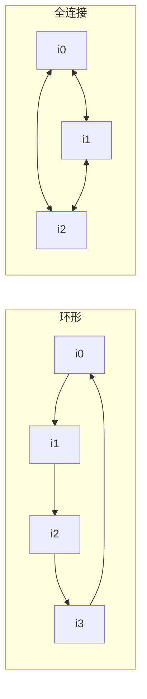

# Island GA 编排器

Island GA 是默认的、最简单的编排器。多个独立种群（"岛屿"）并行进化，并周期性互相迁移个体。当你想得到**单个最佳算法**、数据集大致同质时，这是最合适的起点。

## 何时选

- 你想要一次快速、可预期的单目标运行。
- 数据集没有明显的聚类结构。
- 可以把岛屿摊到多核上做并行探索。

多目标用 [MEoH](meoh.md)，异质数据用 [DyCA](dyca.md)。对比详见[编排方法概览](orchestration.md)。

## 配置

```yaml
evolution:
  type: "island_ga"
  max_generations: 30

  # 每岛
  num_islands: 5
  island_population_size: 6
  parallel_islands: true

  # 算子（继承自 EvolutionConfig）
  elite_ratio: 0.1
  mutation_rate: 0.3
  crossover_rate: 0.5
  parent_selection_strategy: "tournament"
  survival_selection_strategy: "truncation"
  tournament_size: 3

  # 迁移
  migration_interval: 5                # 每多少代迁移一次
  migration_rate: 0.1                  # 每岛迁移比例
  migration_strategy: "best"           # 或 "random" / "elite" / "worst"
  migration_topology: "ring"           # 或 "full" / "hierarchy" / "mesh"

  # 可选：按岛覆盖参数
  per_island_config:
    0: { mutation_rate: 0.5 }          # 岛 0 探索更激进
```

`IslandGAConfig`（`src/llm4ad/config/evolution.py`）负责校验这些字段。

## 工作机制

1. **初始化** — 用 `init_sampler` 创建 `num_islands` 个种群，每岛 `island_population_size` 个体。
2. **每一代，每岛并行**（`parallel_islands: true`）：
   - 按 tournament / roulette / rank 选父代。
   - 用 `mutation_sampler` 和 `crossover_sampler` 生后代。
   - 按 `survival_selection_strategy` 保留存活者。
3. **每 `migration_interval` 代**：按 `migration_topology` 和 `migration_strategy` 迁移 `migration_rate × island_size` 个个体。
4. **停止条件**：达到 `max_generations` 或触发 `early_stop_patience`。

编排器在 `src/llm4ad/orchestrator/island_ga.py`。它默认使用标准采样器（`init_sampler`、`mutation_sampler`、`crossover_sampler`）；多模态任务可替换为 `multimodal_*` 变体并设 `multimodal.enabled: true`。

## 迁移拓扑



- `ring` — 每岛把个体发给下一个；便宜，信息传播慢。
- `full` — 全互通；信息传播快，但多样性衰减更快。
- `hierarchy` — 树形结构；岛多时有用。
- `mesh` — 通过 `per_island_config` 自定义邻接。

## 实战

排序与 TSP 默认示例都用 Island GA：

```bash
llm4ad run examples/applications/sorting_benchmark_python/config.yaml
llm4ad run examples/applications/tsp_benchmark_python/config.yaml
```

两份走读（[排序](../examples/sorting.md)、[TSP](../examples/tsp.md)）的默认配置是 `num_islands: 2`、`island_population_size: 2-4`，便于冒烟。真实实验把它们调到 `num_islands: 4-8`、`island_population_size: 6-10`。

## 调参

- **`num_islands × island_population_size`** 是总种群大小。目标 20–60；LLM 便宜可上调，昂贵则压低。
- **`migration_interval`** ≈ `max_generations / 5` 是合理默认。过频则岛屿同质化，过疏则各自漂移。
- **`elite_ratio: 0.1–0.2`** 保留最优个体，避免被坏运气抹掉。
- **`tournament_size`** 控制选择压力：2 = 软，5+ = 硬。默认 3 是好中点。
- 想要异质性，可用 `per_island_config` 让一部分岛激进探索（高 `mutation_rate`），另一部分稳态利用（低 `mutation_rate`，高 `elite_ratio`）。

## 相关链接

- [编排方法概览](orchestration.md) — Island GA / DyCA / MEoH 对比
- [配置指南](configuration.md) — Island GA 字段全表
- 源码权威：`src/llm4ad/orchestrator/island_ga.py`
