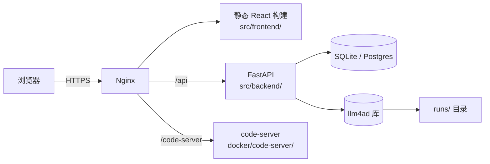

# Web UI 概览

LLM4AD 提供一个可选的 Web UI，由 FastAPI 后端 + React + Vite 前端组成。它对外暴露的能力与 CLI 一致，并加入了项目管理、配置表单、运行监控、"快速分析"轨迹视图，以及你正在读的这份 in-app 使用手册。

本页讲架构、部署模式、环境变量与延伸阅读。

## 架构



三个容器可单机部署，也可分别上不同主机。

| 组件 | 路径 | 用途 |
|---|---|---|
| 前端 | `src/frontend/` | React + Vite + TypeScript；生产模式下用 nginx 提供静态资源 |
| 后端 | `src/backend/` | FastAPI 服务，对外暴露项目/任务/报告/provider 等 API |
| code-server | `docker/code-server/` | 可选的浏览器内 VS Code，用于编辑生成代码 |

## 运行模式

### 开发（不依赖 Docker）

```bash
# 后端
cd src/backend
uv sync
uv run fastapi dev app/main.py            # http://localhost:8000

# 前端
cd src/frontend
bun install
bun run dev                               # http://localhost:5173
```

前端开发服务器把 `/api/*` 转发到后端（见 `src/frontend/vite.config.ts`）。两边都支持热重载。

### Docker（接近生产）

每个组件都有 Dockerfile：

- `src/backend/Dockerfile` — Python 3.12 + uv，启动 `fastapi run --workers 4 app/main.py`。
- `src/frontend/Dockerfile` — 多阶段：bun 构建 → nginx 提供。静态资源（含 `docs/` 树，见 Dockerfile 第 11 行）在构建时打包进镜像。
- `docker/code-server/` — 可选浏览器版 VS Code。

可以用你自己的 `docker-compose.yml` 编排（仓库根目录可放一份模板），核心结构：

```yaml
services:
  backend:
    build:
      context: .
      dockerfile: src/backend/Dockerfile
    environment:
      - LLM4AD_DATABASE_URL=sqlite:////data/llm4ad.db
      - LLM4AD_RUNS_DIR=/data/runs
    volumes:
      - llm4ad-data:/data

  frontend:
    build:
      context: .
      dockerfile: src/frontend/Dockerfile
      args:
        - VITE_API_URL=https://app.example.com/api
        - VITE_CODE_SERVER_URL=https://app.example.com/code-server
    ports:
      - "80:80"
    volumes:
      - ./src/frontend/extra-conf.d:/etc/nginx/extra-conf.d:ro
```

前端镜像接受两个构建参数：

| 构建参数 | 用途 |
|---|---|
| `VITE_API_URL` | 后端地址，烘焙进 JS bundle |
| `VITE_CODE_SERVER_URL` | code-server 地址（可选） |

镜像内 nginx 配置在 `src/frontend/nginx.conf`；可以把额外片段挂到 `/etc/nginx/extra-conf.d/` 加 SSL、鉴权等。

## 环境变量（后端）

后端配置走环境变量（事实源见 `src/backend/app/config.py`）。常用项：

| 变量 | 默认值 | 用途 |
|---|---|---|
| `LLM4AD_DATABASE_URL` | `sqlite:///./llm4ad.db` | SQLAlchemy URL，存项目/任务/报告 |
| `LLM4AD_RUNS_DIR` | `./runs` | 流水线运行目录的 `base_dir` |
| `LLM4AD_BUILDS_DIR` | `./builds` | `llm4ad chat` 按用户输出的目录 |
| `LLM4AD_CODE_SERVER_URL` | _未设置_ | 设了之后前端会显示"在 IDE 中打开"链接 |
| `LLM4AD_DEFAULT_MODEL` | _未设置_ | 用户未指定时的默认 LLM provider |

每个用户的 provider 凭据加密保存在数据库中，由 Web UI 的设置页管理；从不以明文写盘。

## 应用内使用手册

Web UI 内建的**使用手册**就在你眼前。它在前端构建时直接从 `docs/` 目录加载 markdown：

```
src/frontend/Dockerfile          : COPY ./docs /docs
src/frontend/vite.config.ts      : alias @docs → ../../docs
src/frontend/src/components/Guide/UserManualContent.tsx
                                 : import.meta.glob("@docs/**/*.md") → /{lang}/{key}.md
src/frontend/src/components/Guide/guide.config.ts
                                 : 导航层次
```

也就是说：改 `docs/{en,zh}/...` 之后，下次前端构建即可生效，不需要任何上传或调用。要加一页，把 markdown 放到 `docs/{en,zh}/<key>.md`，再在 `guide.config.ts` 里加一条对应的 `key:` 即可。集成模式见[前端集成](frontend-integration.md)。

## 延伸阅读

- [前端集成](frontend-integration.md) — 把 LLM4AD 流水线嵌入到多租户 web 平台
- [自动构建（chat）](../guides/auto-builder.md) — Web UI 自动生成新项目时使用的工作流
- `src/backend/app/api/llm4ad/` — 提供给前端的 REST 接口
- `src/frontend/src/components/Guide/` — 使用手册前端源码
